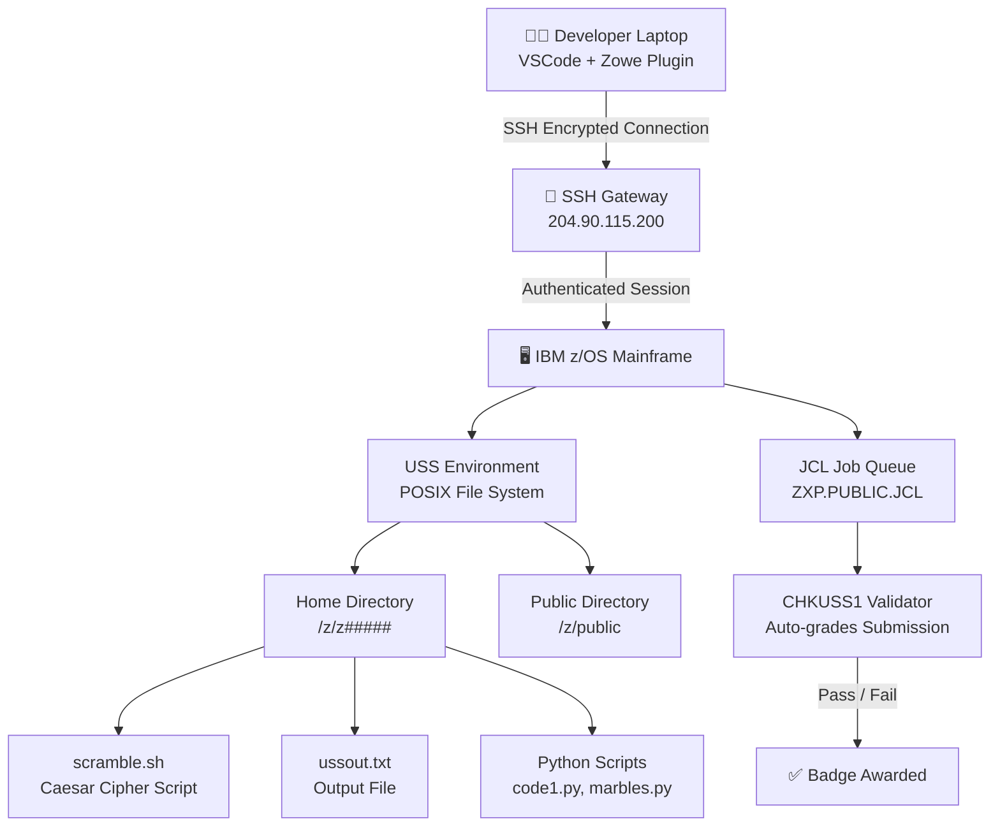
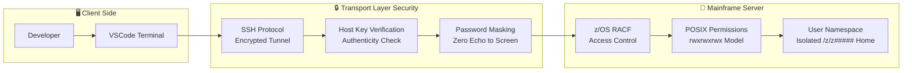
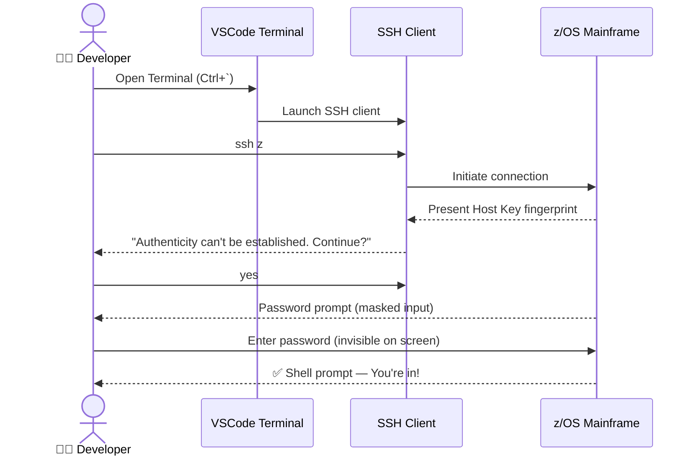
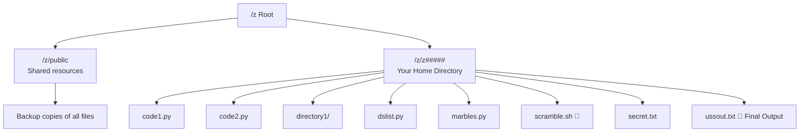
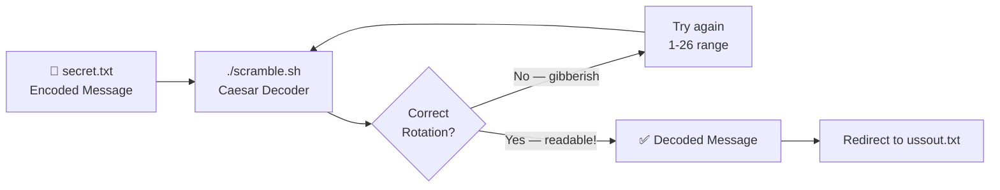
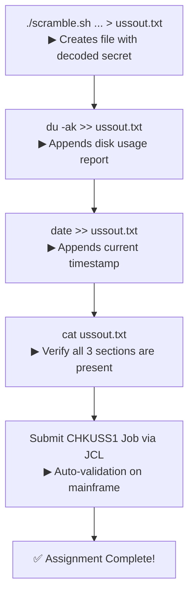
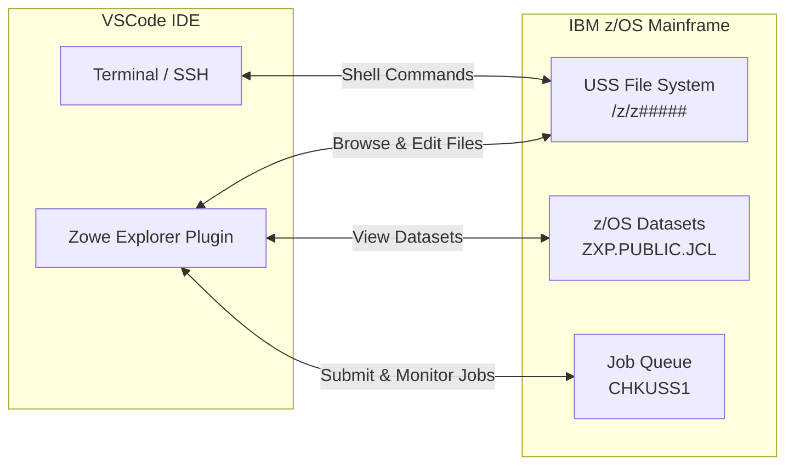
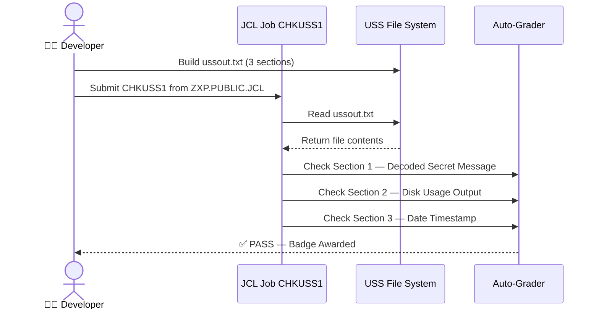

<!-- ANIMATED HEADER -->
<div align="center">


<br/>


<br/>

> **"Navigating a 60-year-old operating system that powers 68% of the world's transaction volume — through a modern IDE — like it's second nature."**

</div>

---

## 📖 What Is This Project?

This repository documents my completion of **USS1** — the first UNIX System Services challenge in the **IBM Z Xplore** learning program. In plain English: I logged into one of the most powerful computing platforms on the planet (IBM Mainframe / z/OS), navigated its UNIX environment from scratch, cracked an encoded secret message, and packaged the results for automated validation — all in under 60 minutes.

If you're a hiring manager wondering *"can this person actually work on enterprise-grade infrastructure?"* — this is your answer. Mainframes process **$10 trillion in financial transactions daily**, and very few developers know how to touch them.

---

## 🎯 The Challenge At A Glance

| Category | Detail |
|---|---|
| **Course** | IBM Z Xplore — Fundamentals Track |
| **Module** | USS1 — UNIX System Services |
| **Total Steps** | 12 |
| **Estimated Time** | 60 minutes |
| **Platform** | IBM z/OS Mainframe |
| **Environment** | USS (UNIX System Services) — POSIX Compliant |
| **Tools Used** | VSCode, Zowe Plugin, SSH, Bash Shell, JCL |
| **Validation** | Automated job `CHKUSS1` submitted via `ZXP.PUBLIC.JCL` |

---

## 🗺️ The Big Picture — What Is USS?

Think of z/OS like a luxury skyscraper. Most people know about the lobby (the traditional mainframe interface). **USS (UNIX System Services)** is the entire modern floor built *inside* that skyscraper — a fully functional UNIX/Linux-like environment that runs alongside the mainframe's core systems, sharing the same powerful hardware and security model.

```
┌──────────────────────────────────────────────┐
│                  IBM z/OS                    │
│                                              │
│  ┌─────────────────┐  ┌────────────────────┐ │
│  │  Traditional    │  │  UNIX System       │ │
│  │  Mainframe      │  │  Services (USS)    │ │
│  │  (JCL, COBOL,   │  │  (Shell, Python,   │ │
│  │   Datasets)     │  │   Scripts, Files)  │ │
│  └─────────────────┘  └────────────────────┘ │
│           ↕  Same OS, Same Security, Same Hardware ↕  │
└──────────────────────────────────────────────┘
```

---

## 🏗️ System Architecture



---

## 🔐 Security Architecture

Security on a mainframe is not an afterthought — it's baked into every single layer. Here's exactly what protects this environment:



### 🛡️ Security Features Breakdown

| Feature | What It Does | Why It Matters |
|---|---|---|
| **SSH Encryption** | All data between your laptop and the mainframe is encrypted in transit | Nobody can intercept your commands or output on the network |
| **Host Key Verification** | The mainframe proves its identity before you connect | Prevents "man-in-the-middle" attacks — you're talking to the real server |
| **Password Masking** | No characters appear on screen while typing your password | Prevents shoulder-surfing and screen recording attacks |
| **POSIX File Permissions** | Every file has `read`, `write`, `execute` flags per user/group/other | Fine-grained control — only authorized users can run executables |
| **User Isolation** | Each user gets their own home directory `/z/z#####` | One user cannot accidentally (or maliciously) touch another's files |
| **RACF Integration** | z/OS Resource Access Control Facility governs all access | Enterprise-grade identity and access management built into the OS |
| **Session Timeout** | Idle SSH sessions terminate after 3-5 minutes | Reduces risk of unattended open sessions being exploited |

---

## 📋 Step-by-Step Walkthrough

### Connection Flow



---

### All 12 Steps

```mermaid
graph LR
    S1["1️⃣ Find Terminal<br/>VSCode"] --> S2["2️⃣ Connect<br/>SSH"]
    S2 --> S3["3️⃣ Verify<br/>Password Auth"]
    S3 --> S4["4️⃣ Explore<br/>ls + uss-setup"]
    S4 --> S5["5️⃣ Get Oriented<br/>pwd"]
    S5 --> S6["6️⃣ Navigate<br/>cd + paths"]
    S6 --> S7["7️⃣ Create Files<br/>touch + mkdir"]
    S7 --> S8["8️⃣ Zowe GUI<br/>Visual Explorer"]
    S8 --> S9["9️⃣ Crack Code<br/>./scramble.sh"]
    S9 --> S10["🔟 Redirect Output<br/>> ussout.txt"]
    S10 --> S11["1️⃣1️⃣ Disk Usage<br/>du -ak >>"]
    S11 --> S12["1️⃣2️⃣ Timestamp<br/>date >> + Submit"]
```



---

## 🗂️ File System Layout

After running `uss-setup`, the home directory looks like this:

```
/z/z#####/              ← Your personal home directory
├── code1.py            ← Python script sample
├── code2.py            ← Python script sample
├── directory1/         ← Practice subdirectory
├── dslist.py           ← Script: lists z/OS datasets
├── marbles.py          ← Python fun demo
├── members.py          ← Script: works with dataset members
├── scramble.sh         ← 🔐 Caesar cipher shell script
├── secret.txt          ← Encoded secret message
├── test                ← Test file
└── ussout.txt          ← 📄 YOUR FINAL OUTPUT FILE
```



---

## 🔑 The Secret — Caesar Cipher Challenge

Step 9 is where things get interesting. There's a shell script called `scramble.sh` that implements a **Caesar Cipher** — a classic encryption technique where each letter in a message is shifted by a fixed number of positions in the alphabet.

```
Original:  A B C D E F G ... Z
Shifted+3: D E F G H I J ... C

"HELLO" with rotation 3 → "KHOOR"
```

**The challenge:** The `secret.txt` file contains an encoded message. You have to run `scramble.sh` and guess the correct rotation value (1–26) to decode it.

```bash
# Run the decoder
./scramble.sh /z/public/secret.txt

# The script asks for a rotation number (1-26)
# Keep trying until the output makes sense!
# Hint: Use logic, not brute force — think about letter frequency
```

### Cipher Logic Visualized



---

## 📤 Output Construction (Steps 10–12)

The final output file `ussout.txt` is built in three stages using **output redirection** — one of the most powerful concepts in any UNIX shell:



### The Two Redirection Operators

| Operator | Behaviour | Risk Level |
|---|---|---|
| `>` | **Overwrite** — creates a new file or replaces existing content | ⚠️ Destructive — cannot undo! |
| `>>` | **Append** — adds content to the end of an existing file | ✅ Safe — existing data preserved |

---

## ⌨️ Complete Command Reference

Every command used in this assignment, explained in plain English:

| Command | Example | Plain English Meaning |
|---|---|---|
| `ssh` | `ssh z12345@204.90.115.200` | "Connect me securely to this remote computer" |
| `ls` | `ls` | "List everything in the current folder" |
| `ls -l` | `ls -l` | "List everything with details: size, permissions, date" |
| `pwd` | `pwd` | "Tell me exactly where I am right now" |
| `cd` | `cd directory1` | "Go into this folder" |
| `cd ..` | `cd ..` | "Go back one folder level" |
| `cd ~` | `cd ~` | "Take me straight home no matter where I am" |
| `cd -` | `cd -` | "Take me back to the last directory I was in" |
| `touch` | `touch mynewfile` | "Create an empty file with this name" |
| `mkdir` | `mkdir mynewdir` | "Create a new folder" |
| `rm` | `rm mynewfile` | "Delete this file permanently" |
| `rmdir` | `rmdir mynewdir` | "Delete this empty folder" |
| `cp` | `cp /z/public/test ~/test` | "Copy this file to my home folder" |
| `cat` | `cat ussout.txt` | "Print the contents of this file to the screen" |
| `du -ak` | `du -ak` | "Show me how much disk space everything is using, in kilobytes" |
| `date` | `date` | "Print the current date and time" |
| `exit` | `exit` | "Log out and close my connection" |
| `uss-setup` | `uss-setup` | "Run the initial setup script to populate my home folder" |
| `./scramble.sh` | `./scramble.sh` | "Run the scramble script in the current directory" |

---

## 🔗 Zowe — The Bridge Between Old and New

**Zowe** is an open-source framework that gives you a modern graphical interface into the mainframe — right inside VSCode. Think of it as a file explorer for the mainframe.



With Zowe, you get:
- **Point-and-click** file browsing on the mainframe (no command needed)
- **Direct file editing** in VSCode — edit mainframe files like any local file
- **Job submission** — run JCL jobs and see results without a green-screen terminal
- **Dataset access** — browse traditional z/OS datasets alongside USS files

---

## 📊 Skills Demonstrated

| Skill Category | Specific Skills |
|---|---|
| **Mainframe Fundamentals** | z/OS navigation, USS environment, POSIX compliance |
| **Security** | SSH authentication, host key verification, file permissions |
| **Shell Scripting** | Bash commands, output redirection, shell script execution |
| **Cryptography** | Caesar cipher decoding, rotation analysis |
| **File Management** | Hierarchical directory navigation, file creation/deletion |
| **Tool Integration** | VSCode + Zowe mainframe explorer, CLI + GUI hybrid workflow |
| **Job Control** | JCL job submission, automated validation pipelines |
| **Problem Solving** | Iterative decryption, disk usage analysis, structured output building |

---

## 💡 Key Concepts — Plain English Glossary

| Term | Plain English Explanation |
|---|---|
| **z/OS** | IBM's operating system for mainframes. The same OS that runs your bank's core systems. |
| **USS** | The UNIX-style environment living inside z/OS. It's like having Linux embedded in your mainframe. |
| **POSIX** | A standard that ensures UNIX-like systems all behave consistently. USS follows this standard. |
| **SSH** | Secure Shell — an encrypted "tunnel" for remote login. Like a private phone line to the server. |
| **Shell** | The command-line interpreter. You type commands, it talks to the OS. |
| **Zowe** | An open-source tool providing a modern UI for mainframes inside VSCode. |
| **JCL** | Job Control Language — mainframe's way of describing and submitting batch jobs. |
| **RACF** | IBM's security manager for mainframes. Controls who can access what. |
| **Caesar Cipher** | A simple encryption where letters are shifted by a fixed number of positions. |
| **Redirection** | Sending command output to a file instead of the screen (using `>` or `>>`). |
| **Tab Completion** | Press Tab and the shell auto-completes file/folder names — massive time saver. |

---

## 🧪 Validation & Testing

The assignment is graded automatically by the mainframe itself. Here's how that works:



### What the Validator Checks

```
ussout.txt must contain:
┌──────────────────────────────────────┐
│  [1] Decoded secret message          │  ← From scramble.sh with correct rotation
│  [2] Disk usage report (du -ak)      │  ← All files/dirs with kb sizes
│  [3] Current date/time stamp         │  ← From the date command
└──────────────────────────────────────┘
```

---

## ⚡ Pro Tips I Picked Up

These are the tricks that separate slow mainframe workers from fast ones:

```bash
# 🚀 Tab Completion — type partial name then press TAB
cd dir<TAB>          # auto-completes to "directory1"

# ⬆️ Command History — press UP arrow to recall previous commands
# Great for re-running scramble.sh with different rotation values

# 🏠 Always know how to get home
cd ~                 # instant home, from anywhere

# 🔄 Jump back to last location
cd -                 # toggle between last two directories

# 🔍 See hidden details about files
ls -l                # shows permissions, size, date

# 💾 Safe appending vs dangerous overwriting
cmd >> file.txt      # SAFE: adds to end
cmd > file.txt       # DANGEROUS: wipes and replaces

# 🧹 Recover deleted files from the public backup
cp /z/public/test ~/test

# 💀 Kill a frozen SSH session
~.                   # escape sequence to force-disconnect
```

---

## 🌍 Why Mainframe Skills Are Rare & Valuable

```
Global Fortune 500 companies using mainframes:  71%
Daily financial transactions on mainframes:     $10 Trillion
World's airline reservations processed:         90%
World's credit card transactions:              ~30 Billion/year

Average age of mainframe professionals:         50+
New graduates entering mainframe space:         < 1%
```

> **The skills gap is real.** IBM estimates that over **750,000 mainframe professionals** will retire in the next 5-10 years. Developers who can bridge modern DevOps practices with mainframe expertise are extraordinarily rare — and extraordinarily valuable.

---

## 🛠️ Tech Stack

```mermaid
graph TD
    A["💻 Developer Tools"] --> A1["VSCode 1.80+"]
    A --> A2["Zowe Explorer Plugin"]
    A --> A3["SSH Client (built-in / PuTTY)"]

    B["🖥️ Mainframe Platform"] --> B1["IBM z/OS"]
    B --> B2["USS — UNIX System Services"]
    B --> B3["POSIX.1 Compliance"]
    B --> B4["RACF Security"]

    C["📜 Languages & Scripts"] --> C1["Bash / USS Shell"]
    C --> C2["Python 3.x (code1.py, marbles.py)"]
    C --> C3["JCL (Job Control Language)"]
    C --> C4["Shell Script (.sh)"]

    D["🔒 Security Protocols"] --> D1["SSH v2"]
    D --> D2["Host Key Pinning"]
    D --> D3["POSIX File Permissions"]
```



---

## 📁 Repository Structure

```
ibm-zxplore-uss1/
├── README.md               ← You are here
├── docs/
│   └── USS1.pdf            ← Original assignment document
├── scripts/
│   └── notes.md            ← Personal notes on each step
└── output/
    └── ussout.txt.example  ← Example of the final output structure
```

---

## 🚀 How To Reproduce This

1. **Enroll** in [IBM Z Xplore](https://www.ibm.com/z/resources/zxplore) (free)
2. **Set up** VSCode with the Zowe Explorer extension
3. **SSH** into the provided mainframe: `ssh z#####@204.90.115.200`
4. Run `uss-setup` to populate your home directory
5. Follow the 12 steps to navigate, decode, and build `ussout.txt`
6. Submit `CHKUSS1` job from `ZXP.PUBLIC.JCL` to validate

---

## 🏅 Certification & Badges

This challenge is part of the **IBM Z Xplore Fundamentals** track, an official IBM learning program designed to grow the next generation of mainframe professionals.

| Badge | Track | Issued By |
|---|---|---|
| USS1 — UNIX System Services | Fundamentals | IBM Z Xplore |
| Digital credential upon completion | Verifiable on Credly | IBM |

---

<div align="center">

### 👋 About The Developer

**Anand Sundar** — Senior Full-Stack Engineer with 9+ years building payment infrastructure, distributed systems, and real-time backends in **Go, Python, and SQL**.

Currently expanding deep into **mainframe technology, cloud architecture (AWS), and cybersecurity** — because the most impactful systems in the world run on infrastructure most developers are afraid to touch.

[](https://linkedin.com/in/anandsundar96)
[](https://github.com/anandsundar)

---

*IBM Z Xplore is a free learning platform by IBM. USS1 is part of the Fundamentals track. All content © IBM 2021–2025.*

</div>
